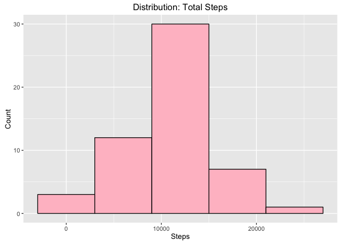

# Reproducible Research: Peer Assessment 1
#Summary
This document was produced as the first project for Coursera's Reproducible Research course.

The objective was to analyze the data contained in activity.csv and report the findings. Both the code and results have included in this R markdown document for peer review. The author's running commentary is included in italics.

*Include the multiplot() function code*

```r
    # Multiple plot function
    #
    # ggplot objects can be passed in ..., or to plotlist (as a list of ggplot objects)
    # - cols:   Number of columns in layout
    # - layout: A matrix specifying the layout. If present, 'cols' is ignored.
    #
    # If the layout is something like matrix(c(1,2,3,3), nrow=2, byrow=TRUE),
    # then plot 1 will go in the upper left, 2 will go in the upper right, and
    # 3 will go all the way across the bottom.
    #
    multiplot <- function(..., plotlist=NULL, file, cols=1, layout=NULL) {
      library(grid)
      
      # Make a list from the ... arguments and plotlist
      plots <- c(list(...), plotlist)
      
      numPlots = length(plots)
      
      # If layout is NULL, then use 'cols' to determine layout
      if (is.null(layout)) {
        # Make the panel
        # ncol: Number of columns of plots
        # nrow: Number of rows needed, calculated from # of cols
        layout <- matrix(seq(1, cols * ceiling(numPlots/cols)),
                         ncol = cols, nrow = ceiling(numPlots/cols))
      }
      
      if (numPlots==1) {
        print(plots[[1]])
        
      } else {
        # Set up the page
        grid.newpage()
        pushViewport(viewport(layout = grid.layout(nrow(layout), ncol(layout))))
        
        # Make each plot, in the correct location
        for (i in 1:numPlots) {
          # Get the i,j matrix positions of the regions that contain this subplot
          matchidx <- as.data.frame(which(layout == i, arr.ind = TRUE))
          
          print(plots[[i]], vp = viewport(layout.pos.row = matchidx$row,
                                          layout.pos.col = matchidx$col))
        }
      }
    }
```

## Loading and preprocessing the data
*Package dependencies are called out.*

```r
  library(dplyr)
```

```
## 
## Attaching package: 'dplyr'
```

```
## The following objects are masked from 'package:stats':
## 
##     filter, lag
```

```
## The following objects are masked from 'package:base':
## 
##     intersect, setdiff, setequal, union
```

```r
  library(ggplot2)
  library(lattice)
  library(lubridate)
```

```
## 
## Attaching package: 'lubridate'
```

```
## The following object is masked from 'package:base':
## 
##     date
```

*Working directory is set and the data is read from the .csv file.*

```r
  setwd("/Users/mistermaxx/Documents/work/personal/Coursera/Repro_Res/")
  
  # read data from file
  activity.file.data <- read.csv("activity.csv")
```


## What is the mean total number of steps taken per day?
*The aggregate() function is used to summarize the data.*

```r
  # calc distrubtion of steps
  steps.data <- aggregate(steps ~ date, activity.file.data, sum)
```

*Using ggplot, a histogram of the data is created.*

```r
  #create histogram with ggplot
  histogram.steps.data <- ggplot(data = steps.data, aes(steps.data$steps)) 
  histogram.steps.data + geom_histogram(color = "black", fill = "pink", bins = 10, binwidth = 6000) + labs(x = "Steps", y = "Count", title = "Distribution: Total Steps")
```

<!-- -->

```r
    # calc, report mean & median
  mean.steps <- mean(steps.data$steps)
  median.steps <- median(steps.data$steps)
  
  print(mean.steps)
```

```
## [1] 10766.19
```

```r
  print(median.steps)
```

```
## [1] 10765
```
*The mean total steps per day is 1.0766189\times 10^{4}*

## What is the average daily activity pattern?
*Calculate the mean of steps per interval.*

```r
  # calc mean of steps/interval
  interval.steps.data <- aggregate(steps ~ interval, activity.file.data, mean)
```

*Graph the data using ggplot.*

```r
  #plot graph using ggplot
   graph.data <- ggplot(interval.steps.data, aes(interval, steps))
   graph.data + geom_line(color = "purple") + labs(x = "Interval", y = "Steps", title = "Steps Per Interval")
```

<!-- -->

*Calculate which interval has the maximum number of steps*

```r
  # max interval
  max.interval.steps <- interval.steps.data[which.max(interval.steps.data$steps), 1]

  print(seconds_to_period(5 * (max.interval.steps) * 60))
```

```
## [1] "2d 21H 35M 0S"
```
*The interval at Wednesday, 9:35 pm (2 days, 21 hours, 35 minutes) has the highest spike and the maximum number of steps.*

## Imputing missing values


```r
  # missing values
  incomplete.data <- sum(!complete.cases(activity.file.data))
```

*Fill in missing data.*

```r
  imputed.data <- transform(activity.file.data, steps = ifelse(is.na(activity.file.data$steps), interval.steps.data$steps[match(activity.file.data$interval, interval.steps.data$interval)], activity.file.data$steps))
```

*Create a histogram from the aggregated data.*

```r
  imputed.data[as.character(imputed.data$date) == "2012-10-01", 1] <- 0
  
  imputed.steps.data <- aggregate(steps ~ date, imputed.data, sum)
  hist(imputed.steps.data$steps, main = paste("Total Steps Each Day"), col = "purple", xlab = "Number of Steps")
  
  hist(steps.data$steps, main = paste("Total Steps Each Day"), col = "orange", xlab = "Number of Steps", add = TRUE)
  legend("topright", c("Imputed", "Non-imputed"), col = c("purple", "orange"), lwd = 10)
```

<!-- -->

*Calculate the mean for imputed values*

```r
  # calc imputed mean & median
  mean.imputed.steps <- mean(imputed.steps.data$steps)
  median.imputed.steps <- median(imputed.steps.data$steps)
  
  # difference
  mean.difference <- mean.imputed.steps - mean.steps
  median.difference <- median.imputed.steps - median.steps
  
  total.difference <- sum(imputed.steps.data$steps) - sum(steps.data$steps)
  
  print(total.difference)
```

```
## [1] 75363.32
```

*Imputing values to the dataset increases the median values.*

## Are there differences in activity patterns between weekdays and weekends?
*Calculate the difference in activity between weekdays and weekends*

```r
  weekdays <- c("Monday", "Tuesday", "Wednesday", "Thursday", "Friday")
  
  imputed.data$weekday = as.factor(ifelse(is.element(weekdays(as.Date(imputed.data$date)), weekdays), "Weekday", "Weekend"))
  
  #aggregate
  imputed.steps.interval.data <- aggregate(steps ~ interval + weekday, imputed.data, mean)
  
   # subset and separate data by weekday, weekend days
  weekday.data <- subset(imputed.steps.interval.data, imputed.steps.interval.data$weekday == "Weekday")
  
  # calc weekday mean
  mean.weekday <- mean(weekday.data$steps)
  
  # plot weekday graph
  plot.weekday <- ggplot(weekday.data, aes(interval, steps))
  graph1 <- plot.weekday + geom_hline(yintercept = mean.weekday, color = "red") + geom_line(color = "turquoise2") + coord_cartesian(xlim = c(-0, 2500)) + labs(x = "Interval", y = "Steps", title = "Steps Per Interval: Weekdays")
  
  # plot weekend graph
  weekend.data <- subset(imputed.steps.interval.data, imputed.steps.interval.data$weekday == "Weekend")
  mean.weekend <- mean(weekend.data$steps)
  plot.weekend <- ggplot(weekend.data, aes(interval, steps))
  graph2 <- plot.weekend + geom_hline(yintercept = mean.weekend, color = "red") + geom_line(color = "maroon4") + coord_cartesian(xlim = c(-0, 2500)) + labs(x = "Interval", y = "Steps", title = "Steps Per Interval: Weekend")
  
  
  multiplot(graph1, graph2)
```

<!-- -->

*The graphs show that on average, activity is higher on the weekend than the weekdays.*
